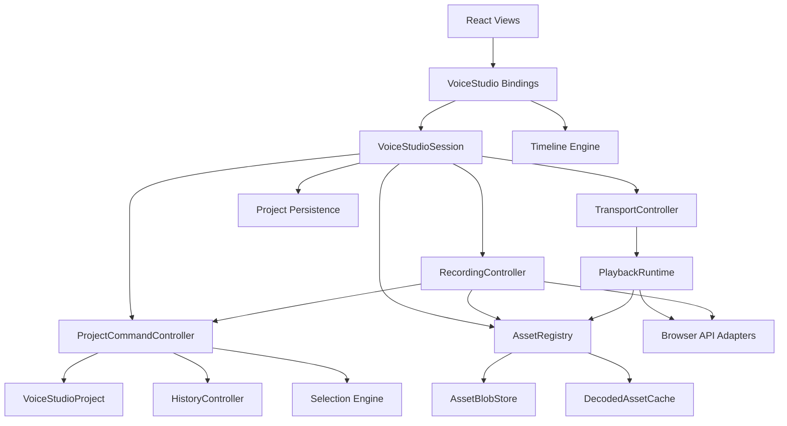
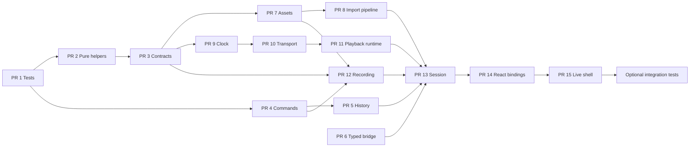

# Hub Voice Studio V2 — Roadmap arquitetural

> Comparativo entre a arquitetura atual do Hub e os princípios observados no openDAW. Este documento é exclusivamente arquitetural. Nenhum código de produção foi alterado.

## 1. Objetivo

Evoluir o Voice Studio do Hub de uma DAW funcional fortemente composta dentro de componentes React para uma arquitetura modular, testável e com lifecycles explícitos, preservando o modelo atual `Project -> Tracks -> Clips -> Assets` e evitando importar prematuramente a complexidade do openDAW.

A meta não é reproduzir o openDAW. O Hub deve adotar apenas os princípios que resolvem problemas reais:

- estado persistente separado do runtime;
- comandos de domínio fora da UI;
- transport e clock únicos;
- captura com lifecycle explícito;
- assets separados de blobs e buffers decodificados;
- histórico agrupado por intenção do usuário;
- dependências explícitas e substituíveis;
- React limitado à composição visual e bindings.

## 2. Resumo executivo

O Hub já possui uma base melhor do que uma primeira leitura superficial sugere. Existem engines puros para projeto, timeline, seleção, histórico, gravação e playback, além de persistência própria. O problema central não é ausência total de módulos; é que a orquestração ainda converge em `VoiceStudioDaw` e `VoiceStudioDawRuntime`.

O openDAW resolve esse problema separando:

1. modelo persistente;
2. editing/history;
3. facade de engine;
4. runtime de áudio;
5. serviços de assets;
6. composition root da aplicação.

No Hub, essas fronteiras existem parcialmente, mas ainda são atravessadas por refs, callbacks, eventos globais de `window`, acesso direto a APIs nativas e estado React local.

A estratégia recomendada é incremental. Primeiro estabilizar contratos e comandos. Depois criar session, transport, assets e recording controllers. Somente ao final considerar AudioWorklet, scheduler dedicado ou outro runtime mais sofisticado.

## 3. Módulos equivalentes

| Conceito openDAW | Módulo equivalente no Hub | Grau de equivalência | Observação |
|---|---|---:|---|
| Project / ProjectSkeleton | `voice-studio-project-model.ts` | Alto | O Hub já possui modelo normalizado, helpers puros e invariantes de clips/assets. |
| ProjectApi | Helpers exportados do project model | Médio | As operações existem, mas não estão reunidas em uma API ou command layer única. |
| EngineFacade | `voice-studio-playback-engine.ts` + estado em `VoiceStudioDaw` | Baixo | O engine executa playback, porém não existe facade estável para transport, recording, CPU, clock e lifecycle. |
| Runtime de áudio | `VoiceStudioPlaybackEngine` + refs de `AudioContext`, nodes, timers e MediaRecorder | Médio-baixo | Existe runtime real, mas distribuído entre engine e componente. |
| Recording | `voice-studio-recording-engine.ts` + lógica de captura em `VoiceStudioDaw` | Médio | Helpers de sessão/asset/commit existem; preparação, monitoramento e lifecycle ainda ficam na UI. |
| Editing / History | `voice-studio-history-engine.ts` | Médio | Há snapshots, merge e undo/redo, mas não há command controller nem índice de estado salvo. |
| Selection | `voice-studio-selection-engine.ts` | Alto | Boa separação, funções puras e reconciliação explícita. |
| Timeline state | `voice-studio-timeline-engine.ts` + `useVoiceStudioTimeline` | Alto | Conversões, zoom, snapping e viewport já estão separados da renderização. |
| Timeline view | Canvas, ruler, markers e mixer | Médio-alto | Componentes especializados já existem, embora bindings ainda dependam do componente principal. |
| AssetService | `voice-studio-project-storage.ts`, importação no runtime e blobs no DAW | Baixo | Responsabilidades de metadados, bytes, decode, peaks e object URLs estão espalhadas. |
| Project storage | IndexedDB + project manager | Médio-alto | Persistência principal existe e é distinta do autosave. |
| Recovery | `voice-studio-autosave.ts` | Médio | Há recovery, mas sem facade transacional única com save state. |
| Transport | Status, elapsed, playhead, timers e botões em `VoiceStudioDaw` | Baixo | Falta controller único e relógio autoritativo. |
| Scheduler | Lookahead dentro do playback engine | Médio | Existe agendamento de áudio/MIDI, mas está acoplado ao engine concreto e APIs do browser. |
| Adapters | Wrappers parciais de storage; tipos locais de MIDI | Baixo | MediaRecorder, AudioContext, Web MIDI e object URLs ainda vazam para a composição React. |
| Session | Não há módulo explícito | Ausente | O componente principal funciona como session implícita. |
| Composition root | `VoiceStudioDawRuntime` + `VoiceStudioDaw` | Baixo | A composição está misturada com DOM portal, upload, sala live e controles de UI. |

## 4. Módulos ausentes

### 4.1 VoiceStudioSession

Falta um objeto de sessão que reúna referências estáveis para:

- projeto atual;
- command controller;
- history;
- selection;
- transport;
- playback runtime;
- recording controller;
- asset registry;
- persistence facade;
- lifecycle/dispose.

Essa session não deve renderizar nada e não deve possuir regras visuais.

### 4.2 ProjectCommandController

As operações puras existem, mas o commit de alterações ainda depende de callbacks e `setProject`. Falta uma única porta para:

- executar comandos;
- registrar histórico;
- agrupar gestures;
- atualizar seleção quando necessário;
- emitir mudanças;
- controlar dirty/saved state.

### 4.3 TransportController

Falta uma camada que concentre:

- play, pause, stop e seek;
- loop;
- seleção como faixa de playback;
- posição autoritativa;
- transições de idle/playing/count-in/recording;
- sincronização entre runtime e React.

### 4.4 PlaybackClock

O Hub ainda mistura `AudioContext.currentTime`, timers, RAF e estado React. Falta um clock explícito com contrato testável.

### 4.5 AssetRegistry

Falta separar claramente:

- `AssetRecord`: metadados persistidos no projeto;
- `AssetBlobStore`: bytes originais;
- `DecodedAssetCache`: `AudioBuffer`, peaks e derivados;
- `ObjectUrlRegistry`: URLs efêmeras e revogação.

### 4.6 RecordingController

O engine atual cobre helpers, mas falta lifecycle completo:

- prepare;
- start;
- stop;
- commit;
- abort;
- dispose.

### 4.7 Browser API adapters

Faltam fronteiras explícitas para:

- `MediaRecorder`;
- `navigator.mediaDevices`;
- `AudioContext`;
- Web MIDI;
- timers/RAF;
- object URLs.

### 4.8 Event bus interno tipado

A integração entre manager, runtime e DAW usa eventos globais do `window`. Falta um canal interno tipado e com ownership claro.

### 4.9 Saved-state tracking

O history engine não funciona como autoridade de dirty state. Falta registrar o índice ou assinatura do último estado salvo.

### 4.10 Runtime diagnostics

Não há facade única para:

- estado do AudioContext;
- falhas de decode/capture;
- overload;
- quantidade de nodes;
- drift;
- latência estimada;
- recursos pendentes.

## 5. Módulos redundantes ou responsabilidades duplicadas

| Redundância | Local atual | Problema |
|---|---|---|
| `makePeaks` | `VoiceStudioDaw` e `VoiceStudioDawRuntime` | Mesmo algoritmo de waveform mantido em duas composições. |
| Criação/fechamento de `AudioContext` | DAW, runtime de importação e playback | Lifecycles diferentes e risco de contexts adicionais desnecessários. |
| Estado de playback | `status`, `elapsed`, engine, timeline view | Várias representações do mesmo estado temporal. |
| Estado de gravação | status React, `RecordingSession`, MediaRecorder refs e runtime externo | Não há uma máquina de estados única. |
| Blob/object URL management | refs do DAW, project storage e runtime de importação | Ownership e revogação ficam implícitos. |
| Eventos de snapshot/load | constantes duplicadas em DAW e runtime | Contrato string-based, global e sem type safety compartilhada. |
| MIME e decode/import | runtime de importação e recording engine | Pipeline de ingestão de assets não é único. |
| MIDI helpers | frequência/instrument wave no componente e scheduling no playback engine | Conhecimento de instrumento atravessa UI e runtime. |
| Timeline position | `project.view.playhead`, `elapsed`, engine current time | Três fontes que precisam permanecer sincronizadas manualmente. |
| History orchestration | engine puro + chamadas locais espalhadas | Cada interação decide como e quando commitar. |

Essas redundâncias não exigem remoção imediata. Primeiro deve existir um destino arquitetural estável; só depois as implementações duplicadas devem convergir.

## 6. Pontos de alto acoplamento

### 6.1 `VoiceStudioDaw`

É o maior ponto de acoplamento. Atualmente reúne:

- estado autoritativo do projeto;
- seleção;
- histórico;
- transport;
- playback;
- gravação;
- monitoramento;
- MIDI;
- clipboard;
- drag/trim/lasso;
- timers e RAF;
- assets/blobs/object URLs;
- atalhos;
- snapshot/load via eventos globais;
- bindings de timeline;
- UI e CSS inline.

O problema não é apenas tamanho. O componente conhece detalhes de todas as camadas, impedindo substituição isolada de runtime, gravação ou persistência.

### 6.2 `VoiceStudioDawRuntime`

Mistura:

- portal e DOM da sala live;
- upload e drag/drop;
- decode de áudio;
- criação de assets;
- comunicação com a DAW;
- descoberta de botões por query selector/texto;
- minimização da cena;
- emergency stop;
- CSS de runtime.

Ele funciona simultaneamente como integration adapter, asset importer e shell visual.

### 6.3 Eventos globais do `window`

`SNAPSHOT_EVENT`, `LOAD_EVENT` e `REQUEST_EVENT` conectam módulos por strings e DOM global. Isso cria:

- dependência implícita;
- dificuldade de testes;
- risco de listeners órfãos;
- falta de ownership;
- baixa rastreabilidade do fluxo.

### 6.4 Projeto e view no mesmo objeto

Persistir `project.view.playhead`, zoom e scroll simplifica recovery, mas faz o modelo do projeto receber atualizações frequentes de UI. Isso aumenta commits, snapshots e autosave sem necessariamente representar edição musical.

### 6.5 Playback concreto acoplado ao browser

O playback engine resolve scheduling, timers, HTMLAudioElement, AudioContext, nodes e callbacks em uma única classe. É funcional, mas difícil de testar e evoluir.

### 6.6 Recording acoplado ao componente

O engine puro não controla o lifecycle dos recursos. O componente possui refs de recorder, stream, analyser, source, monitor gain, RAF, chunks, peaks e MIDI simultaneamente.

### 6.7 Live room e DAW

A DAW está localizada dentro de `app/live/[slug]` e depende de classes e estrutura DOM da sala. Isso dificulta executar o Voice Studio em uma rota independente ou em testes de integração mais controlados.

## 7. Oportunidades de desacoplamento

### 7.1 Separar dado, comando e processo

- **Dado:** `VoiceStudioProject`.
- **Comando:** operações de edição e histórico.
- **Processo:** playback, recording, decode e monitoramento.
- **View:** React.

Essa divisão deve orientar todos os PRs.

### 7.2 Criar contratos antes de mover implementação

Antes de extrair grandes blocos, criar interfaces pequenas:

- `ProjectStore`;
- `CommandDispatcher`;
- `Transport`;
- `PlaybackRuntime`;
- `RecordingRuntime`;
- `AssetBlobStore`;
- `AudioDecoder`;
- `Clock`.

### 7.3 Trocar eventos globais por bridge tipada

No primeiro momento, uma instância local criada pelo runtime pode expor métodos `requestSnapshot`, `loadProject` e `subscribe`. Não é necessário introduzir Redux, Zustand ou provider global.

### 7.4 Tornar React consumidor de snapshots

React deve assinar snapshots estáveis da session, sem possuir diretamente os objetos de áudio.

### 7.5 Manter engines puros

Project, selection e timeline devem permanecer livres de browser APIs. O history engine pode evoluir para patches/comandos, mas sem depender de React.

### 7.6 Isolar assets

Importação, gravação e carregamento devem convergir para o mesmo pipeline de asset:

`bytes -> decode/análise -> AssetRecord -> BlobStore -> ProjectCommand`.

### 7.7 Adotar lifecycle explícito

Todo recurso nativo deve ter owner e `dispose()`:

- AudioContext;
- MediaStream;
- MediaRecorder;
- AudioNode;
- HTMLAudioElement;
- timers;
- RAF;
- object URL;
- MIDI input listener.

## 8. Arquitetura-alvo V2

## 9. Princípios que não devem ser migrados agora

- Não migrar para box graph completo.
- Não introduzir WASM por analogia arquitetural.
- Não mover playback para AudioWorklet antes de medir limitações reais.
- Não criar framework genérico de plugins.
- Não adotar observables próprios em todo o app.
- Não reconstruir a UI.
- Não trocar toda a persistência.
- Não criar uma classe `Project` gigante equivalente à do openDAW.
- Não fundir Voice Studio com engines de duet/recorder de outros domínios.

## 10. Roadmap em aproximadamente 15 PRs

Cada PR deve ser pequeno, reversível e preservar comportamento. Lint, testes e build são obrigatórios. Alterações visuais devem ser evitadas até que a arquitetura esteja estabilizada.

### PR 1 — Consolidar a base de testes dos engines

**Objetivo:** garantir que Project Model, History, Selection, Timeline, Recording helpers e Playback helpers tenham cobertura determinística.

**Escopo:** infraestrutura Vitest, testes dos módulos puros e documentação dos pontos não testáveis.

**Risco:** baixo.

**Critério de saída:** testes, lint e build verdes; nenhuma alteração de runtime.

### PR 2 — Extrair helpers puros duplicados de áudio e MIDI

**Objetivo:** remover duplicação sem alterar fluxo.

**Escopo:** peaks, labels de tempo, MIME helpers, frequência MIDI, wave mapping e validações simples.

**Não fazer:** mover AudioContext, MediaRecorder ou transport.

**Risco:** baixo.

### PR 3 — Introduzir contratos de infraestrutura

**Objetivo:** criar interfaces mínimas para clock, timers, audio decoder, object URLs e blob store.

**Escopo:** tipos e adapters thin wrappers usados inicialmente por código existente.

**Risco:** baixo.

### PR 4 — Criar `ProjectCommandController`

**Objetivo:** tornar uma única camada responsável por aplicar operações puras e commitar histórico.

**Escopo:** move, trim, split, fade, duplicate, paste, delete, add asset/clip e track mutations existentes.

**Risco:** médio.

**Critério:** UI deixa de chamar diretamente helpers de mutação para os comandos migrados.

### PR 5 — Extrair History Controller

**Objetivo:** retirar orchestration de undo/redo do componente.

**Escopo:** engine atual, snapshot de disponibilidade, grouping, merge e saved-state index.

**Risco:** médio-baixo.

### PR 6 — Criar bridge tipada entre Runtime, Manager e DAW

**Objetivo:** substituir os eventos globais string-based.

**Escopo:** request snapshot, load project, import result e subscriptions locais.

**Não fazer:** alterar persistência ou UI.

**Risco:** médio.

### PR 7 — Criar `AssetRegistry` e separar ownership

**Objetivo:** unificar metadados, blobs, object URLs e cache decodificado.

**Escopo:** registry, blob store atual, object URL lifecycle e lookup por assetId.

**Risco:** médio.

### PR 8 — Unificar pipeline de importação de áudio

**Objetivo:** retirar decode, peaks e criação de asset de `VoiceStudioDawRuntime`.

**Escopo:** `AudioAssetImporter` usando os contratos do PR 3 e registry do PR 7.

**Risco:** médio.

### PR 9 — Introduzir `PlaybackClock` e estado de transport

**Objetivo:** definir uma fonte temporal única.

**Escopo:** clock baseado em `AudioContext.currentTime`, snapshot de position/playing e adapter para React.

**Não fazer:** reescrever scheduler.

**Risco:** médio-alto.

### PR 10 — Extrair `TransportController`

**Objetivo:** centralizar play, pause, stop, seek, loop e faixa de seleção.

**Escopo:** comandos de transport, máquina de estados e integração com playback engine existente.

**Risco:** alto.

**Critério:** `VoiceStudioDaw` não mantém transições próprias de playback.

### PR 11 — Isolar Playback Runtime e Scheduler

**Objetivo:** separar API pública de playback da implementação browser-specific.

**Escopo:** interface `PlaybackRuntime`, scheduler, node/audio disposal e métricas de drift.

**Não fazer:** AudioWorklet/WASM.

**Risco:** alto.

### PR 12 — Extrair `RecordingController`

**Objetivo:** criar lifecycle explícito de gravação.

**Escopo:** prepare/start/stop/commit/abort/dispose, count-in, latency compensation e punch já existentes.

**Risco:** alto.

**Critério:** refs nativas de gravação deixam de existir no componente React.

### PR 13 — Criar `VoiceStudioSession`

**Objetivo:** reunir controllers e lifecycles em uma composição estável.

**Escopo:** project state, commands, history, selection, transport, playback, recording, assets e persistence facade.

**Risco:** alto, porém controlado pelos PRs anteriores.

### PR 14 — Migrar `VoiceStudioDaw` para bindings da Session

**Objetivo:** transformar o componente em composição visual.

**Escopo:** hooks/bindings finos, selectors e callbacks de view.

**Não fazer:** redesign, CSS ou novas funcionalidades.

**Critério:** o componente não instancia AudioContext, MediaRecorder, playback engine ou history engine.

### PR 15 — Separar o shell da sala live do core da DAW

**Objetivo:** permitir que o Voice Studio funcione fora do DOM específico da live.

**Escopo:** shell de portal/minimize/emergency controls como integration adapter; core montável em rota isolada ou harness de testes.

**Risco:** médio-alto.

### PR opcional 16 — Observabilidade e testes de integração

**Objetivo:** validar o sistema V2 como conjunto.

**Escopo:** diagnostics, resource leak checks, project-load/play/record/save flows e harness controlado de browser.

**Risco:** médio.

## 11. Dependências entre PRs

## 12. Critérios de governança para cada PR

Cada PR deve declarar:

1. comportamento preservado;
2. arquivos de produção alterados;
3. contratos novos ou removidos;
4. testes adicionados;
5. comandos realmente executados;
6. riscos de regressão;
7. rollback possível;
8. próxima dependência do roadmap.

Regras:

- no máximo uma fronteira arquitetural principal por PR;
- nenhuma feature nova junto com extração;
- nenhuma atualização ampla de dependências;
- nenhum redesign durante migração;
- não substituir implementação antiga até a nova estar coberta;
- manter adapters pequenos e concretos;
- preservar formato persistido do projeto durante todo o roadmap, salvo PR específico de migração futura.

## 13. Indicadores de sucesso da V2

A arquitetura V2 estará consolidada quando:

- `VoiceStudioDaw` for predominantemente visual;
- não houver APIs nativas de áudio dentro de componentes React;
- houver uma única fonte de verdade para transport;
- recording possuir lifecycle explícito;
- projeto e runtime puderem ser recriados separadamente;
- assets tiverem ownership claro;
- histórico for comandado por intenções, não callbacks dispersos;
- load/save/import não dependerem de eventos globais do `window`;
- a DAW puder ser montada fora da sala live;
- engines puros continuarem testáveis em Node;
- testes de integração detectarem leaks de timers, nodes, streams e object URLs.

## 14. Tabela final de decisão

| Conceito | Vale migrar? | Como adaptar ao Hub |
|---|---|---|
| Separação Project/Runtime | Sim, prioridade máxima | Manter `VoiceStudioProject` puro e criar session/controllers efêmeros. |
| Engine facade | Sim | Criar interfaces de transport/playback/recording, sem copiar a facade inteira. |
| Graph persistente | Não agora | Continuar com modelo normalizado e comandos puros. |
| History por updates reversíveis | Parcialmente | Evoluir snapshots para comandos/patches apenas onde houver ganho mensurável. |
| Saved history index | Sim | Integrar ao History Controller para dirty state confiável. |
| AudioWorklet/WASM | Não agora | Considerar somente após profiling do scheduler atual. |
| Asset services separados | Sim | Criar registry, blob store, decoded cache e object URL registry. |
| Recording lifecycle | Sim | Controller com prepare/start/stop/commit/abort/dispose. |
| Clock autoritativo de áudio | Sim | `AudioContext.currentTime` encapsulado em PlaybackClock. |
| Session com lifecycle | Sim | Composition root pequeno, sem UI e sem regras de timeline. |
| Adapters para browser APIs | Sim | Wrappers concretos e testáveis, evitando mocks globais. |
| Event bus global | Não | Substituir por bridge local tipada ou métodos da session. |
| Studio service central gigante | Não | Distribuir responsabilidades em controllers pequenos. |
| Timeline separada da renderização | Já existe; preservar | Continuar engines puros + bindings React. |
| Worklet restart preservando estado | Futuro | Só quando houver runtime substituível e necessidade real. |
| Plugin graph | Não | Fora do escopo do produto atual. |

## 15. Recomendação imediata

A ordem segura após a base de testes é:

1. helpers puros duplicados;
2. contratos de browser/runtime;
3. command controller;
4. history controller;
5. bridge tipada;
6. assets;
7. clock e transport;
8. playback e recording;
9. session;
10. React bindings;
11. separação da sala live.

Essa sequência reduz acoplamento antes de mover responsabilidades críticas e evita uma refatoração ampla do `VoiceStudioDaw` sem rede de segurança.