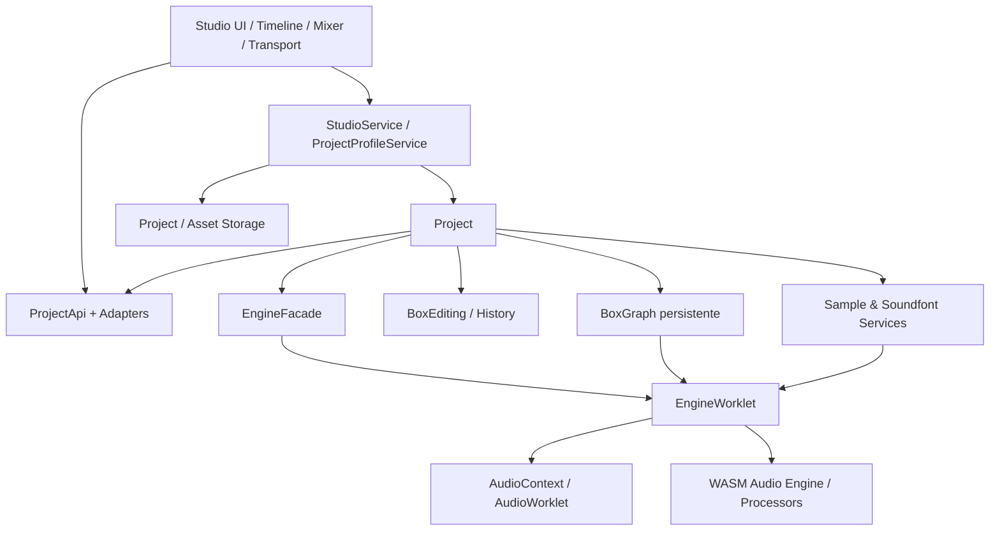
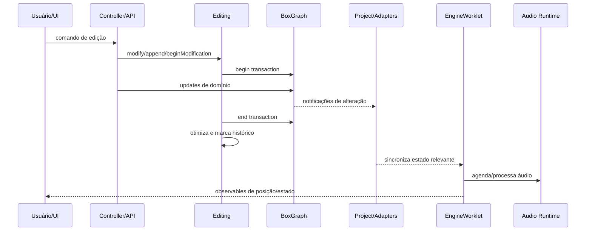
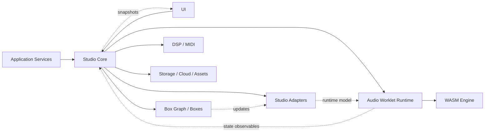

# Auditoria arquitetural do openDAW

> Documento de referência arquitetural. Nenhum código do openDAW foi copiado e nenhum código de produção do Hub foi alterado.

## 1. Visão geral

O openDAW é organizado como um monorepo em camadas, com forte separação entre:

1. **Aplicação e interface** — composição da experiência de estúdio, navegação, workspace, timeline, menus e serviços de alto nível.
2. **Core de domínio da DAW** — projeto, captura, assets, MIDI, mixer, seleção, edição e fachada do motor.
3. **Modelo persistente em grafo** — entidades serializáveis, relações e atualizações transacionais.
4. **Adapters** — convertem boxes persistentes em objetos de domínio e visualização mais convenientes.
5. **Runtime de áudio** — AudioWorklet, processadores, engine em WASM e comunicação entre main thread e thread de áudio.
6. **Bibliotecas de infraestrutura** — observables, lifecycle, UUID, DSP, MIDI, serialização, armazenamento e sincronização.

A decisão mais importante é a separação entre **estado autoritativo do projeto** e **estado efêmero do runtime de áudio**. O projeto existe como um grafo editável e serializável; o engine recebe uma projeção desse estado e executa playback, gravação, monitoramento e scheduling em ambiente de tempo real.

## 2. Fluxo de inicialização

O boot ocorre em duas fases conceituais.

### 2.1 Inicialização da aplicação

A aplicação cria um `AudioContext`, os registradores de worklets, serviços globais de samples e soundfonts, dispositivos de saída, autenticação de cloud e metadados de build. Esses objetos são entregues ao serviço central do estúdio.

O serviço central:

- cria estado global de layout e timeline;
- configura snapping e intervalo visível;
- instancia serviços de assets, presets, recovery e navegação;
- escuta mudanças de projeto e preferências;
- instala comandos globais;
- restaura projeto ou recovery quando aplicável.

### 2.2 Inicialização de projeto e engine

Ao criar ou carregar um projeto:

1. Um esqueleto de projeto é criado ou decodificado.
2. Migrações e validações são executadas.
3. O `Project` recebe o grafo e as boxes obrigatórias.
4. Adapters, seleção, mixer, tempo map, capture devices e outros controladores são ligados ao grafo.
5. O projeto cria um `EngineWorklet` pelo ambiente recebido.
6. O worklet é conectado ao destino do `AudioContext`.
7. A `EngineFacade` passa a espelhar os observables do worklet.
8. Após o engine sinalizar readiness, recursos dependentes do runtime são restaurados.

O restart do engine preserva posição e estado de playback, desmonta assinaturas antigas, recria o worklet e remonta as telas dependentes.

## 3. Session

O openDAW não concentra toda a sessão em uma única classe chamada `Session`. O conceito é distribuído entre:

- **StudioService** — sessão da aplicação;
- **ProjectProfile** — projeto ativo mais metadados, origem e estado de persistência;
- **Project** — sessão editável do domínio;
- **EngineFacade + EngineWorklet** — sessão de execução de áudio;
- **serviços P2P/room awareness** — sessão colaborativa.

A sessão efetiva é, portanto, uma composição de contextos com lifecycles próprios. O ponto positivo é permitir descarregar o runtime sem destruir o projeto. O ponto de atenção é que a orquestração pode ficar excessivamente centralizada no serviço da aplicação.

### Adaptação sugerida ao Hub

Criar futuramente um `VoiceStudioSession` leve, responsável apenas por reunir referências estáveis:

- projeto atual;
- controller de edição/histórico;
- transport;
- playback runtime;
- recording runtime;
- asset registry;
- lifecycle/dispose.

Ele não deve renderizar UI nem conter regras de timeline.

## 4. Runtime

O runtime representa tudo que não precisa ser persistido no projeto:

- estado corrente de playback;
- posição derivada do relógio de áudio;
- nodes e processadores ativos;
- buffers carregados;
- monitoramento;
- CPU load;
- mensagens de clips e notas;
- estado de gravação e count-in;
- recursos do worklet.

O openDAW mantém esse runtime separado do modelo persistente. A `EngineFacade` atua como porta estável para a aplicação, enquanto a implementação real pode ser reiniciada ou substituída.

### Princípio migrável

O Hub deveria tratar `VoiceStudioProject` como dado e `VoiceStudioRuntime` como processo. O runtime deve poder ser recriado a partir do projeto sem migração de dados persistidos.

## 5. Transport

O transport visível é apenas uma interface sobre o engine. As operações principais são:

- play;
- stop;
- reset;
- set position;
- preparação de gravação;
- count-in;
- loop e estados derivados.

O `EngineFacade` expõe observables estáveis para posição, BPM, playing, recording, count-in, timestamp e CPU. A UI não precisa conhecer os detalhes do worklet.

O relógio autoritativo durante execução é o engine de áudio, não `requestAnimationFrame`. A animação da interface acompanha um valor publicado pelo runtime.

### Adaptação ao Hub

Separar futuramente:

- `TransportController`: comandos e transições;
- `TransportState`: observables/snapshot para React;
- `PlaybackClock`: origem temporal baseada em `AudioContext.currentTime`;
- `TransportView`: botões e indicadores.

## 6. Playback

O playback é conduzido fora da UI e próximo ao domínio de áudio. O projeto fornece estrutura, routing, clips, devices e assets; o runtime cria e agenda os processadores.

Responsabilidades observadas:

- acordar ou retomar o `AudioContext` antes de tocar;
- transmitir play/stop/position ao worklet;
- resolver tracks, regions, devices e roteamento;
- publicar posição e estado para a main thread;
- tratar overload e panic;
- suportar lançamento de clips e sinais MIDI;
- descarregar nodes ao trocar de projeto ou engine.

O motor não usa o componente visual como scheduler. Isso elimina grande parte do acoplamento típico de DAWs implementadas dentro de componentes React.

## 7. Recording

A gravação é uma orquestração de várias capturas armadas.

Fluxo conceitual:

1. Verificar se já existe gravação em andamento.
2. Localizar capture devices armados.
3. Preparar cada captura de forma assíncrona.
4. Limpar regiões gravadas anteriormente quando necessário.
5. Iniciar capturas e automação.
6. Ajustar seleção e estado de transport.
7. Solicitar ao engine count-in/recording.
8. Observar o encerramento do estado de gravação.
9. Finalizar todas as capturas dentro de uma modificação editável.
10. Consolidar o resultado como uma ação de histórico.

A gravação não é tratada como simples retorno de um `MediaRecorder`. Há uma distinção entre:

- preparação;
- captura em tempo real;
- monitoramento;
- criação do asset;
- criação de regions;
- commit transacional.

### Adaptação ao Hub

O Hub deve evoluir para uma `RecordingSession` com lifecycle explícito:

- `prepare()`;
- `start()`;
- `stop()`;
- `commit()`;
- `abort()`;
- `dispose()`.

O commit deve ser a única etapa autorizada a alterar o projeto.

## 8. Project

`Project` é o principal ponto de entrada do domínio. Ele agrega:

- `BoxGraph`;
- boxes obrigatórias;
- API de projeto;
- editing/history;
- seleção local e remota;
- adapters;
- mixer;
- tempo map;
- capture devices;
- MIDI learning;
- asset registrations;
- engine facade;
- freeze;
- foco de timeline;
- resolução de overlaps;
- lifecycle.

A vantagem é oferecer um contexto completo e consistente. A desvantagem é que a classe se torna altamente conectada e pode assumir responsabilidades demais.

### Padrão essencial

O estado persistente não é uma árvore React nem um grande objeto mutado livremente. Ele é um grafo tipado, transacional e observável. Relações entre tracks, regions, clips, devices e buses são referências explícitas.

### Adaptação ao Hub

Não é necessário migrar para um box graph completo agora. O princípio pode ser aplicado com:

- modelo normalizado por IDs;
- operações puras de domínio;
- controller transacional;
- eventos de alteração;
- snapshots somente nos limites de persistência.

## 9. Asset Management

Assets são administrados por serviços especializados, separados do projeto visual.

O fluxo inclui:

- escolha e leitura de arquivos;
- importação e decodificação;
- geração ou preservação de UUID;
- notificação de progresso;
- armazenamento local/cloud;
- registro no projeto;
- invalidação de loaders;
- substituição de arquivos ausentes;
- remoção quando referências deixam de existir.

O projeto mantém metadados e referências; bytes e recursos decodificados ficam em storage/managers apropriados.

### Adaptação ao Hub

Separar três conceitos hoje misturados com frequência:

1. `AssetRecord` — metadados persistidos.
2. `AssetBlobStore` — bytes originais.
3. `DecodedAssetCache` — `AudioBuffer`, peaks e derivados efêmeros.

A remoção deve ser orientada por referência, não apenas por ações da UI.

## 10. History

O histórico é baseado em **updates do grafo**, não em cópia integral do projeto a cada gesto.

Durante uma modificação:

1. O grafo abre uma transação.
2. Updates são observados e coletados.
3. Os updates são otimizados.
4. A modificação é colocada na lista pendente.
5. Um `mark()` sela um ou vários passos como uma entrada lógica.

Isso permite agrupar uma sequência de alterações pequenas em uma única intenção do usuário.

O histórico também conhece a posição salva, permitindo responder `hasUnsavedChanges()` sem comparar o projeto inteiro.

## 11. Undo/Redo

Cada update sabe aplicar sua direção `forward` e `inverse`.

### Undo

- seleciona o grupo anterior;
- aplica os updates em ordem reversa;
- cada update executa sua inversa;
- se houver falha, reaplica o que já foi desfeito e restaura o índice.

### Redo

- seleciona o próximo grupo;
- aplica os updates em ordem normal;
- em falha, desfaz as aplicações parciais e restaura o índice.

Novo commit após undo remove o futuro. Gestos longos podem usar processos explícitos de `approve` ou `revert`.

### Adaptação ao Hub

Vale migrar o conceito de comandos reversíveis, mas não obrigatoriamente o framework de graph updates. Um caminho incremental:

- manter operações puras existentes;
- representar cada operação como `{before, after, metadata}` inicialmente;
- evoluir operações mais pesadas para patches reversíveis;
- permitir grouping por gesture/session ID;
- rastrear saved history index.

## 12. Timeline

A timeline possui uma camada de estado e transformação independente da renderização.

Conceitos relevantes:

- intervalo visível;
- escala PPQN;
- snapping;
- track focus;
- seleção;
- automações de tempo e compasso;
- regiões e overlaps;
- drag/drop convertido em operações de projeto;
- cursor derivado do transport.

O tempo musical usa PPQN como unidade de domínio. Conversões para segundos dependem do tempo map, permitindo automação de BPM sem corromper posições musicais.

### Adaptação ao Hub

O Hub atualmente trabalha majoritariamente em segundos. Para o escopo vocal isso pode continuar, mas convém separar:

- `TimelineCoordinateSystem`;
- `MusicalTime` opcional;
- `TimeToPixelTransform`;
- `SnapPolicy`;
- `ViewportState`;
- `TimelineEditingController`.

## 13. Event Flow

O fluxo de eventos combina observables, notifiers e subscriptions com lifecycle explícito.

Eventos de alta frequência do áudio não percorrem o mesmo caminho de eventos de edição. A main thread recebe apenas informação necessária para interface e controle.

## 14. Scheduler

O scheduler reside no engine de áudio, não na timeline visual.

Responsabilidades:

- converter posição musical em frames/tempo de áudio;
- antecipar eventos dentro de uma janela de processamento;
- resolver regiões ativas;
- disparar notas e clips;
- administrar loops e count-in;
- respeitar tempo map e mudanças de assinatura;
- operar de forma determinística por bloco de áudio.

Com a migração recente para WASM, a execução crítica fica ainda mais isolada da main thread.

### Adaptação ao Hub

Não é necessário portar um scheduler WASM agora. O princípio inicial deve ser:

- scheduler independente de React;
- relógio baseado no `AudioContext`;
- planejamento por lookahead;
- registry de eventos agendados;
- cancelamento idempotente;
- UI consumindo snapshots, nunca comandando cada frame.

## 15. AudioContext

O `AudioContext` é criado no nível da aplicação e injetado no ambiente do projeto. Ele não pertence à timeline nem a um clip individual.

Usos principais:

- criação do AudioWorklet;
- destino de saída;
- sample rate global;
- monitoramento;
- importação/decodificação;
- suspensão durante mixdown;
- resume após gesto do usuário;
- troca/restart do engine preservando o projeto.

### Regra recomendada para o Hub

Manter apenas um contexto principal por sessão do Voice Studio e centralizar:

- `resume()`;
- criação de nodes;
- master bus;
- monitoring bus;
- disposal;
- reconexão de dispositivos.

## 16. Responsabilidades por módulo

| Módulo/conceito | Responsabilidade principal |
|---|---|
| StudioService | Boot da aplicação, composição de serviços e navegação de projeto |
| ProjectProfileService | Carregar, salvar, trocar e proteger o projeto ativo |
| Project | Contexto central do domínio e lifecycle do projeto |
| ProjectApi | Operações de alto nível sobre o modelo |
| BoxGraph | Estado persistente normalizado, relações e transações |
| BoxAdapters | Visões de domínio derivadas das boxes |
| BoxEditing | Captura de updates, grouping, undo/redo e dirty state |
| EngineFacade | API estável do transport/runtime para aplicação |
| EngineWorklet | Ponte main thread ↔ audio thread |
| WASM engine/processors | DSP, scheduling e execução em tempo real |
| CaptureDevices | Descoberta e coordenação das fontes armadas |
| Recording | Lifecycle global de uma tomada de gravação |
| AssetService | Importação, recuperação e notificação de assets |
| Sample/Soundfont Managers | Loading, cache, storage e invalidação |
| TimelineRange/Snapping | Coordenadas, viewport e política de snapping |
| TempoMap | Conversão entre posição musical e tempo |
| Selection | Estado de seleção local/remota independente da UI |
| Mixer | Visão e controle do roteamento de audio units |

## 17. Dependências entre módulos

As dependências formam uma direção predominante:

Dependências que merecem cautela:

- `Project` conhece muitos subsistemas.
- `StudioService` é um composition root, mas também contém regras operacionais.
- adapters e boxes são uma arquitetura poderosa, porém de alto custo cognitivo.
- colaboração e histórico compartilham o mesmo grafo, aumentando complexidade de conflitos.

## 18. Avaliação arquitetural

### Pontos fortes

- separação clara entre persistência e runtime;
- engine reiniciável;
- lifecycle e disposal explícitos;
- edição transacional;
- undo/redo por updates reversíveis;
- scheduler fora da UI;
- assets desacoplados de `AudioBuffer`;
- tempo musical como domínio;
- observables estáveis entre worklet e interface.

### Pontos de atenção

- `Project` e `StudioService` acumulam responsabilidades;
- o box graph tem curva de aprendizagem alta;
- muitas abstrações internas tornam migração literal inadequada;
- worklet/WASM exigem build e debugging especializados;
- arquitetura de colaboração adiciona complexidade desnecessária ao estágio atual do Hub.

## 19. Estratégia recomendada para o Hub

A melhor abordagem é migrar **princípios em camadas**, não classes ou código.

1. Consolidar testes dos engines puros.
2. Separar runtime do projeto persistido.
3. Introduzir controller de histórico com grouping.
4. Criar transport independente de React.
5. Centralizar `AudioContext` e buses.
6. Criar asset registry e decoded cache.
7. Mover scheduling para um serviço com lookahead.
8. Só então avaliar AudioWorklet dedicado.
9. Considerar PPQN apenas quando houver edição musical/MIDI relevante.
10. Evitar graph framework completo até o modelo do Hub realmente exigir relações complexas ou colaboração.

## 20. Matriz de migração

| Conceito | Vale migrar? | Como adaptar ao Hub |
|---|---|---|
| Separação Project/Runtime | **Sim, alta prioridade** | `VoiceStudioProject` persistido e `VoiceStudioRuntime` descartável/recriável |
| EngineFacade | **Sim** | Criar uma fachada pequena para transport, playback, recording e observables |
| AudioWorklet dedicado | **Depois** | Introduzir apenas quando scheduler/main thread virar gargalo comprovado |
| Engine WASM | **Não agora** | Manter TypeScript/Web Audio; avaliar WASM apenas para DSP intensivo |
| BoxGraph | **Parcialmente** | Usar modelo normalizado por IDs e operações puras, sem portar framework completo |
| BoxAdapters | **Parcialmente** | Selectors/adapters pequenos para tracks, clips e assets derivados |
| Editing transacional | **Sim** | Controller que agrupa operações e publica uma alteração atômica |
| Undo/Redo reversível | **Sim** | Evoluir snapshots para patches/comandos reversíveis de forma incremental |
| Saved history index | **Sim** | Detectar dirty state pela posição do histórico, não por comparação profunda |
| Grouping de gestos | **Sim** | Usar gesture ID para drag, trim, fade e ganho |
| Project central agregador | **Com cautela** | Criar session/composition root, mas evitar regras de UI e DSP dentro dele |
| StudioService central | **Não literalmente** | Dividir boot, navegação, projeto ativo e serviços de assets |
| Transport observável | **Sim** | Estado externo ao React com hook de assinatura |
| Relógio pelo AudioContext | **Sim, alta prioridade** | Usar `currentTime` como origem autoritativa durante playback |
| Scheduler por lookahead | **Sim** | Serviço isolado com janela de agendamento e cancelamento idempotente |
| Timeline em PPQN | **Talvez** | Continuar em segundos para áudio vocal; adicionar camada musical opcional |
| TempoMap variável | **Depois** | Implementar quando o produto suportar automação real de BPM |
| Asset metadata/blob/cache separados | **Sim** | Registry persistido, blob storage e cache de `AudioBuffer` independentes |
| Substituição de assets ausentes | **Sim** | Fluxo de relink por asset ID mantendo clips intactos |
| CaptureDevices armados | **Sim** | Registry de inputs com estado armed/monitoring por track |
| RecordingSession lifecycle | **Sim, alta prioridade** | `prepare/start/stop/commit/abort/dispose` |
| Commit de gravação transacional | **Sim** | Só inserir asset e clip após captura validada e finalizada |
| Mixer como domínio separado | **Sim** | Controller de gain/pan/mute/solo independente do componente visual |
| Seleção fora da UI | **Sim** | Engine puro já existente; manter como estado de domínio de interação |
| Lifecycle/Terminable | **Sim como princípio** | `AbortController`, disposers e ownership explícito de subscriptions/nodes |
| Colaboração em grafo | **Não agora** | Não adicionar complexidade P2P/CRDT antes de necessidade de produto |
| Recovery/autosave | **Sim** | Snapshots versionados no IndexedDB/Supabase sem depender do runtime |
| Restart do engine | **Sim** | Permitir recriar playback/recording runtime preservando projeto e posição |
| CPU overload/panic | **Sim** | Monitorar falhas e oferecer stop/panic seguro antes de reinicializar runtime |
