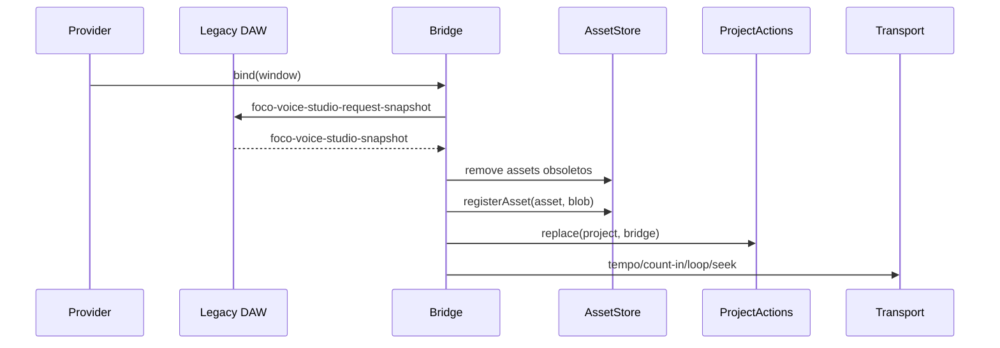

# Voice Studio Legacy Session Bridge

## Objetivo

Sincronizar temporariamente o projeto ainda mantido pelo controlador legado com a `VoiceStudioSession`, permitindo que os novos módulos enxerguem exatamente o mesmo Project, assets, blobs, tempo, loop e playhead exibidos na interface atual.

## Fluxo



## Direção única

A ponte é deliberadamente unidirecional:

```text
Legacy DAW -> Session
```

A Session não reenvia o Project para o controlador legado. Isso evita ciclos de eventos e mantém um único editor enquanto a migração ainda não foi concluída.

## Substituição sem histórico artificial

`ProjectActions.replace()`:

- normaliza o projeto recebido;
- preserva a identidade do objeto oficial da Session;
- limpa o histórico anterior da Session;
- publica `PROJECT_CHANGED`;
- publica o playhead inicial.

Snapshots de sincronização não entram como comandos de Undo/Redo.

## Assets

A cada snapshot:

1. assets que não existem mais no projeto são removidos do AssetStore;
2. assets atuais são registrados;
3. blobs disponíveis criam ObjectURLs através do Runtime;
4. waveforms existentes são armazenadas no cache oficial.

## Motivo desta etapa

O Transport visual Session-backed não pode substituir os controles legados enquanto a Session estiver vazia. Esta ponte garante que a troca seguinte seja atômica e não inicie um segundo motor sobre um projeto diferente.

## Remoção futura

Este módulo deve ser excluído quando:

- o Project oficial passar a ser criado e editado diretamente pela Session;
- importação e gravação usarem exclusivamente o AssetStore;
- o controlador legado deixar de manter estado próprio.
