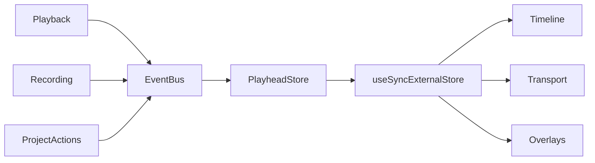

# Voice Studio Session Playhead Store

## Objetivo

Estabelecer uma única fonte visual de playhead para componentes React do Voice Studio.

## Fluxo



## Eventos observados

- `PLAYHEAD_CHANGED`
- `PLAY_STOPPED`
- `RECORD_STOPPED`
- `PROJECT_CHANGED`

## Invariantes

- O valor nunca é negativo.
- Valores inválidos são normalizados para zero.
- Eventos com o mesmo valor não geram nova revisão React.
- Views não calculam tempo por conta própria.
- Views não consultam diretamente Playback ou Recording.

## API

```ts
session.playhead.getSnapshot()
session.playhead.subscribe(listener)
useVoiceStudioPlayhead()
```

## Estado da migração

O relógio visual oficial já pertence à Session. A Timeline legada ainda desenha seu playhead local até a substituição física pela `VoiceStudioTimelineView`.

A região declarativa `Timeline` já observa o store oficial, permitindo que a troca visual seguinte reutilize o mesmo contrato sem alterar Playback, Recording ou Transport.
