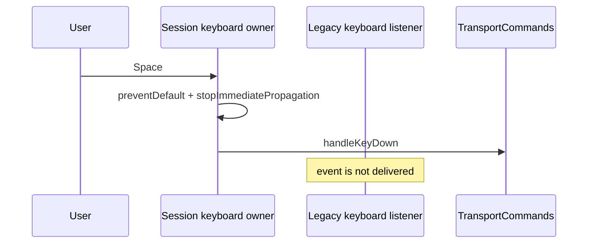

# Voice Studio Session Transport UI

## Goal

Move visual Transport ownership to the Provider-owned `VoiceStudioSession` without allowing the legacy and Session runtimes to respond to the same user intent.

## Components

```text
VoiceStudioTransportKeyboardOwner
VoiceStudioSessionTransport
```

Both consume the official boundary:

```ts
useVoiceStudioSessionTransport()
```

They do not import Playback, Recording, Runtime or EventBus.

## Playback request

The request is built at command time from the live Session project:

```text
Project duration
Current Transport playhead
Current loop configuration
```

This is important because the temporary Legacy-to-Session bridge mutates the official Session project as the editor changes.

## Single Space owner

The keyboard owner is mounted in `Toolbar`, before `TrackArea`.

It registers a capture listener in `useLayoutEffect`, while the monolithic legacy controller registers its shortcut in a passive `useEffect`.



This prevents both audio runtimes from responding to Space.

## Visual ownership

The new footer provides separate controls for:

- Return To Start
- Play
- Pause
- Stop

It also renders the official playhead and explicit State Machine state.

The old `.vs-main-controls` container is hidden. Editing tools, tempo, export, recording controls outside that container, timeline and mixer remain intact.

## Why the legacy source is not deleted in this PR

The current controller is monolithic and its transport functions are still referenced by recording backing tracks, cleanup and internal lifecycle code. Deleting those functions before recording migration would introduce unnecessary risk.

This PR removes the legacy controls from user interaction and guarantees a single keyboard owner. Physical dead-code deletion belongs to the later legacy-cleanup PR after recording and timeline ownership have moved.

## Invariants

1. UI transport intent enters through `TransportCommands`.
2. Space cannot reach the legacy shortcut.
3. The old visual main controls cannot be clicked.
4. Playback requests use the synchronized Session project.
5. Editor tools are not hidden or moved.
6. No second React-owned transport state is introduced.
