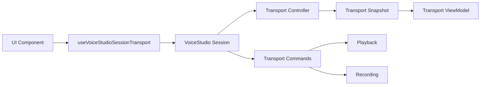

# Voice Studio — Session UI Binding

## Objetivo

Estabelecer uma fronteira React única entre a interface do Voice Studio e a Session, sem iniciar dois runtimes de áudio durante a migração.

## Regra

Componentes de UI não devem importar diretamente:

- Playback;
- Recording;
- Runtime;
- EventBus;
- TransportController.

Eles devem consumir:

```ts
const { snapshot, viewModel, commands } = useVoiceStudioSessionTransport();
```

## Binding



## ViewModel

O ViewModel deriva permissões sem duplicar regras nos componentes:

- `canPlay`;
- `canPause`;
- `canStop`;
- `canRecord`;
- `canReturnToStart`;
- flags explícitas para todos os estados da máquina.

## Compatibilidade

O hook anterior, que recebe um `VoiceStudioTransportController`, foi preservado para testes e consumidores isolados.

## Limite desta PR

O controlador legado ainda renderiza os botões visuais e ainda possui seu próprio PlaybackEngine e fluxo de gravação. Ele não foi conectado diretamente a `session.transportCommands`, porque isso faria o runtime legado e o runtime da Session responderem ao mesmo comando.

Esta PR conecta a região declarativa `BottomTransport` à observação oficial da Session e fornece a API que receberá os botões existentes na próxima etapa.

## Próxima etapa

Mover os controles visuais de Transport para um componente Session-backed e, na mesma alteração, retirar o transporte equivalente do controlador legado. A troca deve ser atômica para garantir que exista somente um runtime ativo.
