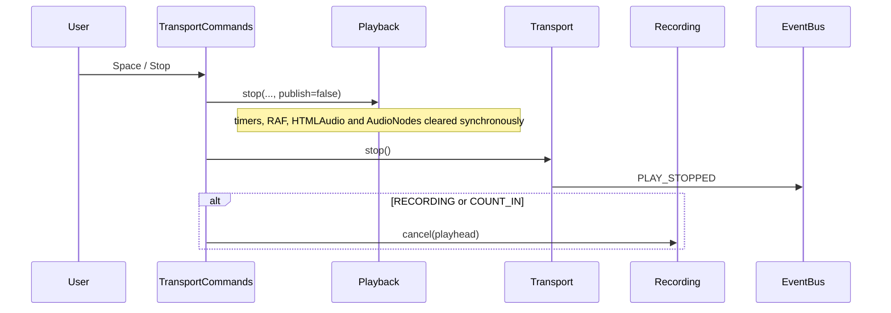

# Voice Studio Transport Commands

## Purpose

`VoiceStudioTransportCommands` is the single command entry point for UI controls and keyboard shortcuts. It coordinates the existing Transport, Playback and Recording modules without replacing them.

## Command priority

```text
User command
    ↓
TransportCommands
    ├── immediate Runtime cleanup
    ├── explicit Transport transition
    └── synchronous EventBus notification
```

The user command always wins over loop, punch, count-in, scheduling and playback completion.

## Public commands

```ts
commands.play(request)
commands.pause()
commands.stop()
commands.returnToStart()
commands.record(input)
commands.space(request)
commands.handleKeyDown(event, request)
```

## Professional semantics

| Command | Result |
| --- | --- |
| Play | Starts from the supplied playhead/range |
| Pause | Preserves the current playhead and enters `PAUSED` |
| Stop | Stops runtime activity immediately and enters `IDLE` |
| Return To Start | Stops immediately, then places the playhead at zero |
| Record | Delegates recording setup to the existing Recording module |
| Space from `IDLE` | Play |
| Space from any active/transient state | Immediate Stop |

## Immediate Stop order



Runtime cleanup occurs before event fan-out. This prevents UI state from reporting stopped while scheduled sound is still active.

## Keyboard safety

Space is ignored when:

- the event is repeated;
- another handler already prevented it;
- focus is inside `input`, `textarea`, `select` or contenteditable;
- the key is not Space.

## Invariants

1. UI code does not call Playback and Recording independently for transport actions.
2. Space never waits for loop, punch, count-in or bar completion.
3. Pause is not Stop.
4. Stop is not Return To Start.
5. Runtime cleanup precedes Transport/EventBus notification.
6. Existing Session, EventBus and module ownership remain intact.
