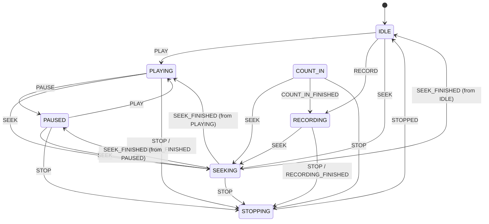

# Voice Studio Transport State Machine

## Objetivo

Formalizar o estado do Transport sem substituir EventBus, Runtime, Playback, Recording ou Session. A State Machine valida transições; o TransportController continua sendo a fachada pública.

## Estados

- `IDLE`: parado e pronto para comandos.
- `PLAYING`: reprodução ativa.
- `PAUSED`: reprodução pausada com posição preservada.
- `RECORDING`: captura ativa.
- `COUNT_IN`: contagem anterior à gravação.
- `STOPPING`: parada imediata em andamento; estado transitório.
- `SEEKING`: reposicionamento em andamento; estado transitório.

## Invariantes

1. Apenas um estado pode estar ativo.
2. `STOP` de qualquer estado ativo entra em `STOPPING`.
3. `STOPPING` só termina com `STOPPED`, chegando a `IDLE`.
4. Transições inválidas não alteram estado.
5. Seek preserva o último estado estável e retorna a ele ao concluir.

## Diagrama

## Escopo desta etapa

Esta etapa introduz a máquina e seus contratos. A integração completa de Space, stop imediato, Playback, Recording e Timeline deve consumir a máquina por meio do TransportController em etapas seguintes, sem criar uma segunda arquitetura paralela.
